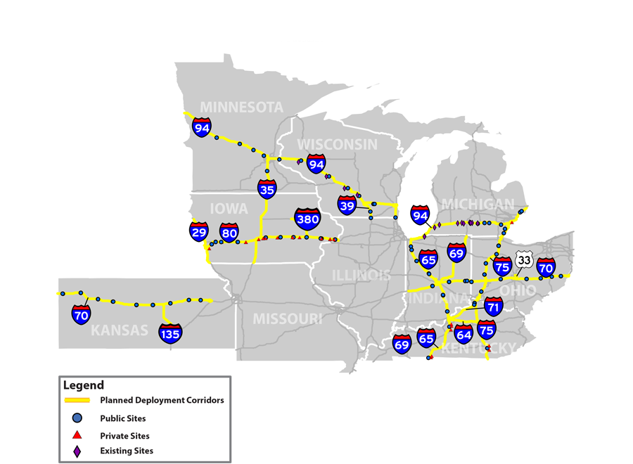
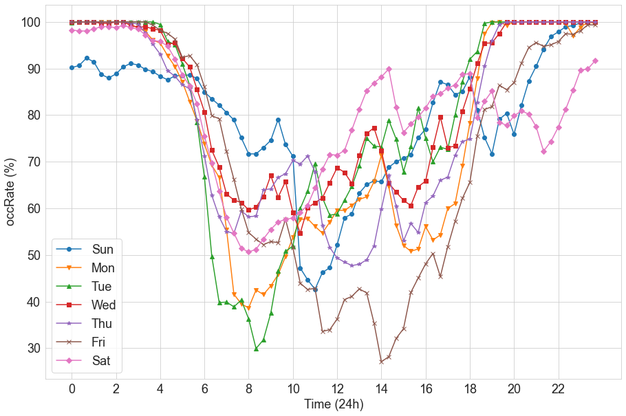
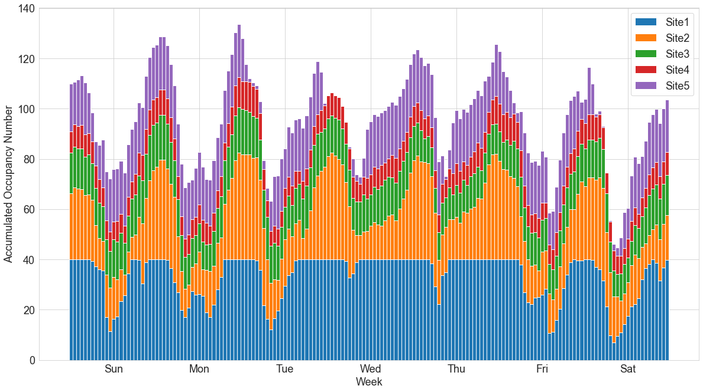
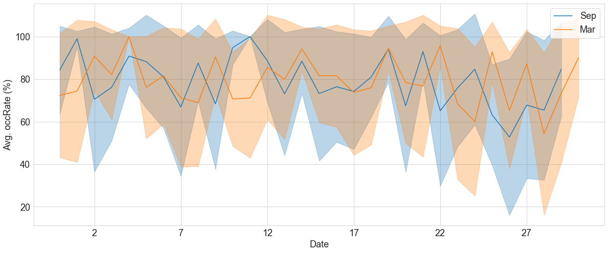
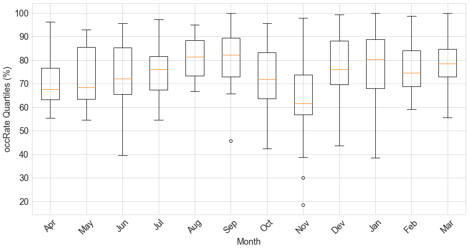

# Truck Parking Dataset (TPIMSDataset)

In this repo, we provide truck parking dataset collecting from Truck Parking Information Management System (TPIMS) in states of Mid America Association of State Transportations Officiels (MAASTO) for time-series problem. All datasets have been preprocessed and raw data are stored as CSV files. You can collect additional raw data from [Truck Parking Query Archive](https://transportal.cee.wisc.edu/applications/TruckParkingQuery/) by TOPS Lab in the University of Wisconsin-Madison.

[Paper for the dataset](https://ascelibrary.org/doi/10.1061/9780784484876.043), [WisTransPortal for more data](https://transportal.cee.wisc.edu/tpims/)

*Dataset list* (updating)

[x] **TPIMS-small**: The data of 104 truck parking sites ranging from Mar. 1st, 2022 to Mar. 15th, 2022.

[x] **TPIMS-medium**: The data of 115 truck parking sites ranging from Mar. 1st, 2022 to Sep. 1st, 2022.

[] **TPIMS-large**: The data of x truck parking sites ranging from Mar. 1st, 2022 to Mar. 1st, 2023.


## Truck Parking Archive Data
Since 2019, we have been developing the data archiving system from the web for truck parking data at nine states participating in MAASTO and now it is widely used from several companies, DOTs, and research labs.

Our supporting states are Illinois, Indiana, Iowa, Kansas, Kentucky, Michigan, Minnesota, Ohio, and Wisconsin. And we are collecting data from over 150 truck parking sites daily.

<p align="center">

</p>


In TPIMS raw data, these are metadata description for all sites.
| Feature | Description 
| :--- | :--- 
| Site ID | Unique fixed‐length identifier including state, route number, route type, reference post, side of road and unique location number or name abbreviation.
| Time Stamp | Provides the date and time that the site record was last updated. 
| Time Stamp Static | Provides the date and time that the site static record was last updated.
| Available | This will be the actual number of spots the detection system is reporting is available. This number can exceed the maximum number of spots and will report actual values under the “Low” threshold or even negative values.
| Trend | Optional. Reports whether the site is emptying, steady or filling. Accepted values: “CLEARING” / “STEADY” / “FILLING” / null. See more detailed description in appendix.
| Open | Will report open unless the parking site is closed to parking for maintenance or another situation. Possible values: true / false / null.
| Trust Data | This flag will report that the site is operating normally. Possible reasons for a “false” value include periods where the site is under construction while open to traffic, IT maintenance windows, or equipment failures. Possible values: true / false / null.
| Reported Available | Number of available spots shared through the data feed. The number is capped at the total number of parking spots at the site and “Low” is reported if the low threshold is reached.
| Manual Reset | Deprecated. -1 for not resetting.
| Low Threshold | If the parking spot availability in the lot is equal to or below this value, the data feed will report “Low” instead of a number.
| Last Verification Check | Date and time of the last manual reset/verification check. Used for performance measures and system monitoring, not for public consumption. Possible values: date and time / null. Null is input if a state is manually providing verification check data to MAFC.
| Verification Check Amplitude | Amplitude of the last manual reset/verification check adjustment. Can be negative, positive or zero.
| Capcity | Total number of parking spots within the site.


## Dataset Pre-process

Make a quick running environment. If you have scikit-learn and pandas already in your virtual environment, ignore this procedure.
```
conda create -n tpims_dataset Python=3.10
conda activate tpims_dataset

pip -r requirements.txt
```

Since our TPIMS format used in the paper is different from the traffic flow dataset format such as METR-LA, you can convert dataset format with `convert_format.py `.

<details open>
<summary>New Method</summary>

Use `TPIMS/raw/tpims_data_{data_size}.csv` and data processing method in this repository. This will generate `TPIMS/processed/tpims_{data_size}.csv` as output.

Below is the example code to prepare dataset for the comparisons. Follow each model repository for more details.

```
python generate_training_data.py --dataset TPIMS --data_size small -s 6 -p 1 --train_ratio 0.8
```
</details>


<details open>
<summary>Old Method (Used in the paper)</summary>

With raw_data as input, please run `create_node_data.py` and `create_link_data.py` to create graph nodes and edges. All converted data will be stored in `TPIMS/processed/links` and `TPIMS/processed/nodes`.

To be used in the other methods/formats, please use `align_with_metr_format.py` for data format conversion. Then run following commands to prepare dataset.

```
python generate_training_data.py --dataset TPIMS --data_size small -s 6 -p 1 --train_ratio 0.8
```
</details>


## Truck Parking Usage Trend

### Average Hourly Occupancy Rate at One Site in a Week Averaged by Days of 4 Weeks

<p align="center">
    
</p>

### Weekly Accumulated Site Occupancy at Top 5 Used Sites (Apr 3 to Apr 9)
<p align="center">
    
</p>

### Daily Transition in a Month (Left: Sep. 2021, Right: Mar. 2022)
<p align="center">
    
</p>

### Monthly Whiskers Data Visualization (Apr. 2021 - Mar. 2022)
<p align="center">
    
</p>


## Note
We used travel time from the closest city collected externally as an input feature in our paper, but this dataset contains lately introduced mile marker. Also, in the original Reg-T repository, we used to store data in csv format for every 10 minutes, but due to the inefficiency, we stored all data in one csv file and updated data loading system.


## Citation
If you find our work useful in your research, please consider to cite followings.

TPIMS Dataset explanation:
```
@inproceedings{rei2023,
 author = {Tamaru, Rei and Cheng, Yang and Parker, Steven and Perry, Ernie and Ran, Bin and Ahn, Soyoung},
 title = {Web Portal Development and Site Usage Pattern Analysis for a Multi-State Truck Parking Information Management System (TPIMS)},
 booktitle = {International Conference on Transportation and Development 2023},
 chapter = {},
 year = {2023},
 pages = {489-500},
 doi = {10.1061/9780784484876.043},
}

```

Truck parking usage prediction:
```
@article{tamaru2024truck,
    title={Truck Parking Usage Prediction with Decomposed Graph Neural Networks},
    author={Tamaru, Rei and Cheng, Yang and Parker, Steven and Perry, Ernie and Ran, Bin and Ahn, Soyoung},
    journal={arXiv preprint arXiv:2401.12920},
    year={2024}
}

```

## Contact
If you want to access to the Truck Parking Query Archive, please contact to transportal@topslab.wisc.edu. For questions or comments about papers, codes, and web site, please reach out to tamaru@wisc.edu.

